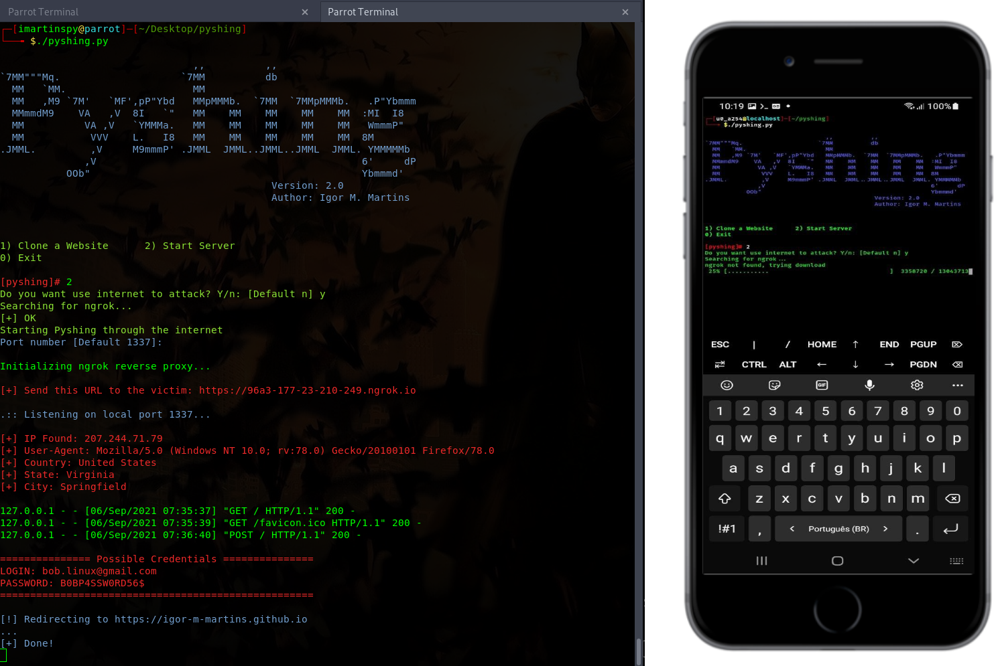

# Pyshing
[Phishing Tool]

```
  $ git clone https://github.com/r4msolo/pyshing.git && pip install -r pyshing/requirements.txt --user && chmod +x pyshing/pyshing.py
```
```
  $ ./phishing.py
```

 
 
 
 WORKS ON TERMUX!